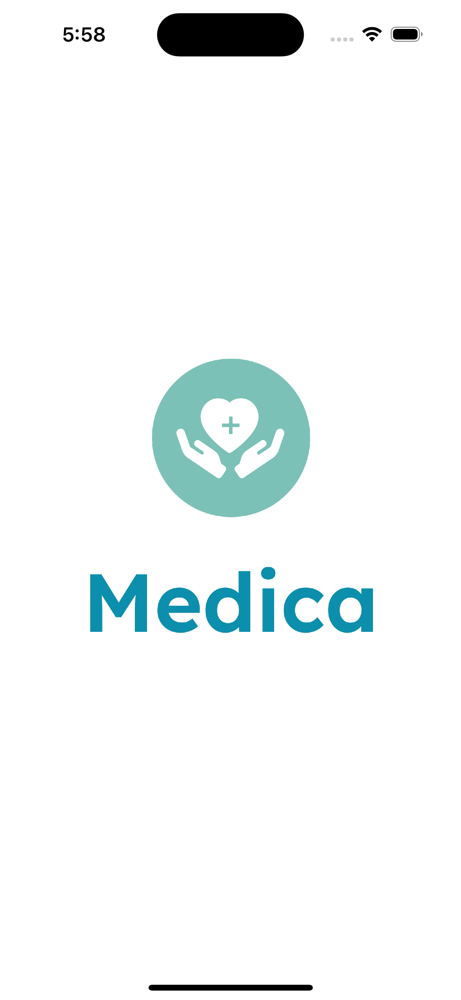
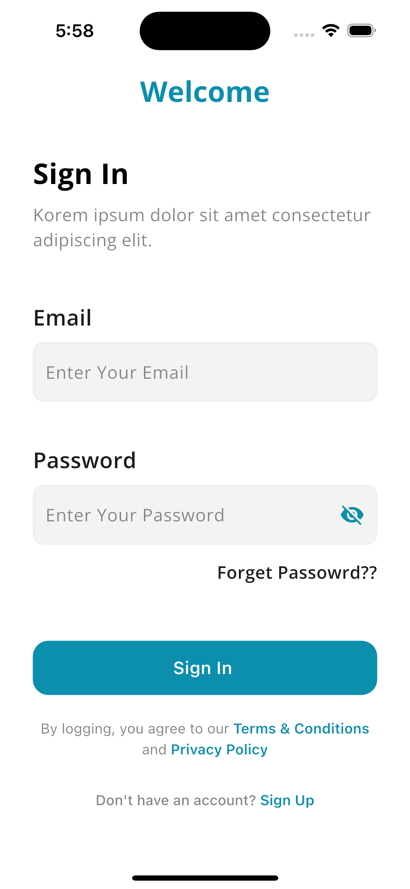
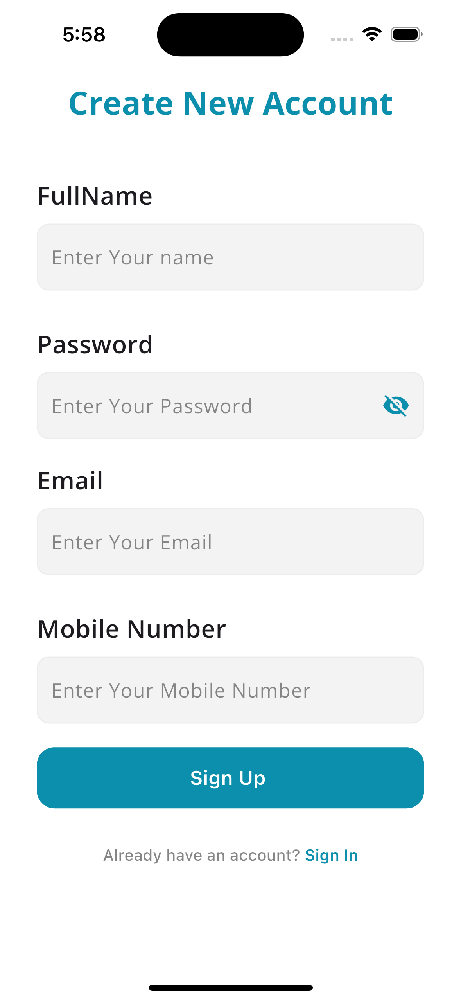
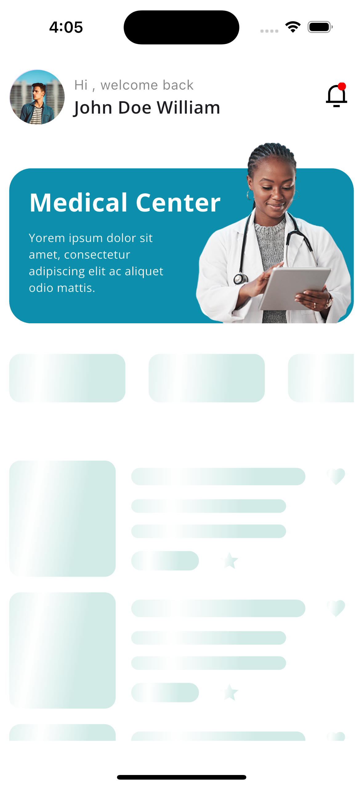
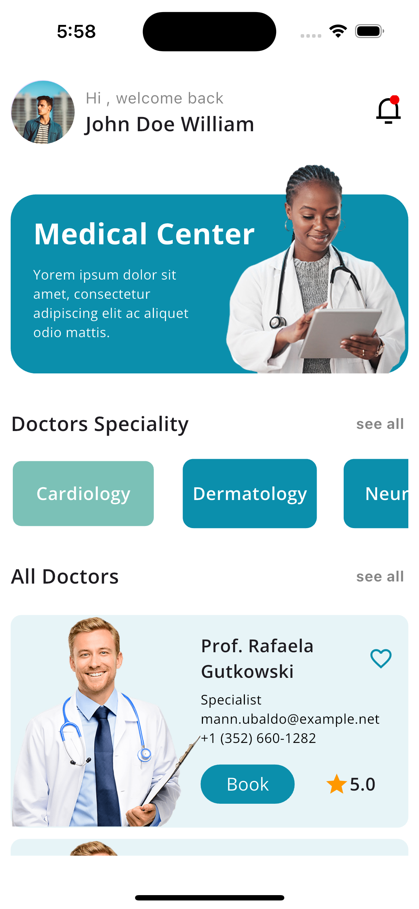

# Advanced Flutter App

A modern Flutter application showcasing best practices and powerful tools for efficient development.

## Key Technologies Used

### Data Management & API Integration
- **Freezed**: Immutable data classes with union types and pattern matching
- **json_serializable**: Automated JSON serialization/deserialization
- **Retrofit**: Type-safe API client with annotation-based approach

### Development Tools
- **SourceTree**: Visual Git workflow management
- **Fastlane**: Automated build, testing, and deployment
- **Flavors**: Environment-specific configurations for iOS and Android

## Getting Started

This project demonstrates advanced Flutter development practices and tooling. To get started:

1. Clone the repository
2. Install dependencies: `flutter pub get`
3. Run the app: `flutter run`

## Development Resources

- [Freezed Documentation](https://pub.dev/packages/freezed)
- [Retrofit Documentation](https://pub.dev/packages/retrofit)
- [Fastlane Documentation](https://docs.fastlane.tools/)

## Screenshots

Here are some screenshots of the application:

| Screenshot 1 | Screenshot 2 |
|-------------|-------------|
|  |  |
| Screenshot 3 | Screenshot 4 |
|  |  |
| Screenshot 5 | Screenshot 6 |
|  |  |

